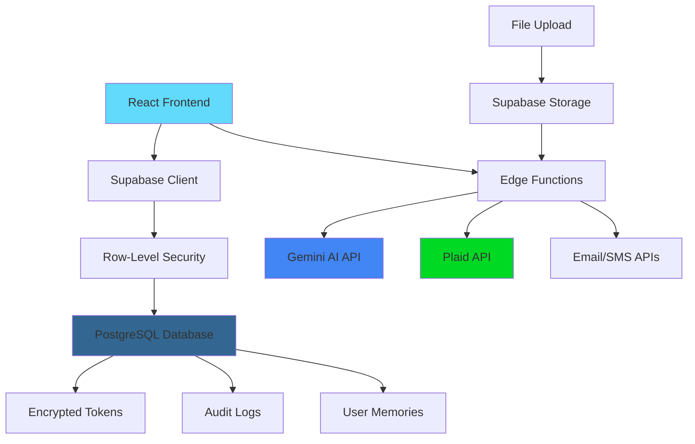

# Pocket Banker - AI-Powered Personal Finance Manager

[](https://lovable.dev)
[](LICENSE)
[](https://reactjs.org/)
[](https://www.typescriptlang.org/)
[](https://supabase.io/)
[](https://supabase.io/)

> 🚀 **Now Live!** Transform your financial life with AI-powered insights, smart budgeting, and seamless bank integration.

**[Try Demo](https://pocket-banker.lovable.app/demo)** | **[Join Waitlist](https://pocket-banker.lovable.app/)** | **[View Live App](https://pocket-banker.lovable.app/)**

## 🚀 Features

### 🤖 AI-Powered Financial Assistant
- **Conversational AI**: Chat with your personal finance assistant powered by Google Gemini 2.0 Flash
- **Document Analysis**: Upload and analyze PDFs, bank statements, and financial documents
- **Smart Categorization**: AI automatically categorizes transactions with high accuracy
- **Spending Insights**: Get personalized recommendations and spending pattern analysis
- **Coach Mode**: Educational guidance with step-by-step financial coaching and tour system

### 💳 Comprehensive Financial Management
- **Bank Integration**: Secure Plaid integration for automatic transaction syncing across multiple accounts
- **Transaction Management**: Real-time transaction tracking with manual categorization override
- **Budget Planning**: Monthly budget creation with category-wise planning and actual vs planned tracking
- **Bill Tracking**: Never miss a payment with intelligent bill reminders and due date notifications
- **Goal Setting**: Set and track financial goals with progress visualization and task management
- **Financial Health**: Real-time dashboard showing income, expenses, and net position

### 📊 Advanced Analytics & Reporting
- **Spending Analytics**: Visual charts and insights powered by Recharts
- **Budget vs Actual**: Monthly and yearly comparisons with progress indicators
- **Category Analysis**: Detailed breakdown of spending by category with trends
- **Shared Budgets**: Generate secure shareable budget reports via email/SMS
- **Export Capabilities**: Download financial data and reports

### 🔒 Security & Privacy
- **End-to-End Encryption**: Plaid tokens encrypted with AES-256-GCM encryption
- **Row-Level Security**: Supabase RLS policies ensure complete data isolation
- **Comprehensive Audit Logging**: Track all security events and access patterns
- **Rate Limiting**: Protection against abuse and unauthorized access
- **Token Rotation**: Automatic security token rotation and monitoring

### 📱 Modern User Experience
- **Responsive Design**: Optimized for desktop, tablet, and mobile devices
- **Dark/Light Theme**: Automatic theme switching with manual override
- **Real-time Updates**: Live data synchronization with Supabase subscriptions
- **Demo Mode**: Try the app with sample data and guided interactive tour
- **Progressive Web App**: Fast loading with lazy-loaded components
- **Accessibility**: ARIA labels and keyboard navigation support

## 🚀 Quick Start

### 🎮 Try It Now
- **[Live Demo](https://pocket-banker.lovable.app/demo)** - Experience all features with sample data
- **[Create Account](https://pocket-banker.lovable.app/auth)** - Get started with your own financial data
- **[Waitlist](https://pocket-banker.lovable.app/)** - Join for early access to new features

### 🛠️ Development Setup

#### Prerequisites
- Node.js 18+ and npm/yarn
- Supabase account and project
- Google Gemini API key (for AI features)
- Plaid account (for bank integration)

#### Local Development

1. **Clone the repository**
   ```bash
   git clone https://github.com/yourusername/pocket-banker.git
   cd pocket-banker
   ```

2. **Install dependencies**
   ```bash
   npm install
   ```

3. **Environment setup**
   ```bash
   cp .env.example .env
   ```
   
   **Important**: This project uses Supabase secrets for security. Do NOT use environment variables for sensitive data.
   
   Only configure public variables in `.env`:
   ```env
   # Public configuration only
   VITE_SUPABASE_URL=https://dscndbpqvhvylukvcgpq.supabase.co
   VITE_SUPABASE_ANON_KEY=your_supabase_anon_key
   ```

4. **Configure Supabase secrets** (for production features)
   ```bash
   # AI Features
   supabase secrets set GEMINI_API_KEY=your_gemini_api_key
   
   # Banking Integration  
   supabase secrets set PLAID_CLIENT_ID=your_plaid_client_id
   supabase secrets set PLAID_SECRET=your_plaid_secret_key
   supabase secrets set PLAID_ENV=sandbox
   supabase secrets set PLAID_ENCRYPTION_KEY=your_32_byte_encryption_key
   
   # Email/SMS (optional)
   supabase secrets set RESEND_API_KEY=your_resend_api_key
   ```

5. **Database setup**
   ```bash
   # Run migrations (creates all tables and security policies)
   supabase db push
   
   # Deploy edge functions
   supabase functions deploy
   ```

6. **Start development**
   ```bash
   npm run dev
   ```

7. **Access the application**
   - **App**: `http://localhost:5173`
   - **Demo Mode**: Click "Try Demo" for instant access with sample data
   - **Live Version**: [pocket-banker.lovable.app](https://pocket-banker.lovable.app)

## 🏗️ Architecture

### Frontend Stack
- **React 18** with TypeScript for type safety
- **Vite** for fast development and optimized builds
- **Tailwind CSS** with custom design system and HSL color tokens
- **Radix UI** components for accessibility and customization
- **React Router** for client-side navigation
- **React Query** for server state management
- **Date-fns** for date manipulation
- **Recharts** for data visualization

### Backend Infrastructure
- **Supabase** as Backend-as-a-Service
- **PostgreSQL** database with Row-Level Security
- **Edge Functions** (Deno) for serverless API endpoints
- **Supabase Auth** for user authentication
- **Supabase Storage** for file uploads with security policies

### External Integrations
- **Google Gemini 2.0 Flash** for AI conversations and analysis
- **Plaid API** for secure bank account connectivity
- **Email/SMS APIs** for notifications and sharing

### Architecture Diagram


## 📊 Database Schema

### Core Tables
- **profiles** - User profiles with encrypted Plaid tokens and security settings
- **accounts** - Bank accounts with balances and Plaid integration data
- **transactions** - Financial transactions with AI categorization and metadata
- **budget** - Monthly budget plans with category-wise allocations
- **goals** - Financial goals with progress tracking
- **goal_tasks** - Sub-tasks for goal achievement
- **bills** - Bill tracking with due dates and payment status
- **conversations** - AI chat history with threading support
- **conversation_threads** - Conversation organization and management
- **user_memories** - Persistent AI context and user preferences
- **budget_shares** - Secure shareable budget tokens
- **plaid_items** - Plaid integration metadata and sync cursors

### Security & Audit Tables
- **plaid_token_audit_log** - Security event logging for token access
- **share_send_log** - Audit trail for budget sharing activities
- **site_metrics** - Application usage statistics

## 🔗 API Endpoints

### Edge Functions
- **POST /functions/v1/gemini-chat** - AI conversation interface with file uploads
- **POST /functions/v1/ai-categorize-transactions** - Bulk transaction categorization
- **POST /functions/v1/ai-spending-insights** - Generate spending analysis reports
- **POST /functions/v1/plaid-link-token** - Generate Plaid Link tokens
- **POST /functions/v1/plaid-link-exchange** - Exchange public tokens for access tokens
- **POST /functions/v1/plaid-sync** - Sync transactions from Plaid
- **POST /functions/v1/plaid-disconnect** - Safely disconnect Plaid accounts
- **POST /functions/v1/send-budget-email** - Email budget reports
- **POST /functions/v1/send-budget-sms** - SMS budget notifications
- **GET /functions/v1/share-get-budget-by-token-secure** - Access shared budgets

### Security Features
- **CORS Enabled** with proper preflight handling
- **JWT Authentication** for protected endpoints
- **Rate Limiting** and request validation
- **Comprehensive Error Handling** with detailed logging
- **Audit Logging** for all sensitive operations

## 🧪 Development

### Available Scripts
```bash
# Development server
npm run dev

# Production build
npm run build

# Development build
npm run build:dev

# Preview production build
npm run preview

# Lint code
npm run lint
```

### Project Structure
```
src/
├── components/          # Reusable UI components
│   ├── ui/             # Shadcn/UI base components
│   └── *.tsx           # Feature-specific components
├── hooks/              # Custom React hooks
├── integrations/       # External service integrations
├── lib/                # Utility libraries
├── pages/              # Page components
├── utils/              # Helper functions
└── assets/             # Static assets

supabase/
├── functions/          # Edge functions
├── migrations/         # Database migrations
└── config.toml         # Supabase configuration
```

### Code Standards
- **TypeScript** for complete type safety
- **ESLint** configuration for code quality
- **Tailwind CSS** with semantic design tokens
- **Component-driven architecture** with reusable patterns
- **Custom hooks** for state management and side effects

## 🛡️ Security (Enterprise-Grade)

### 🔒 Recently Enhanced Security Features
- **✅ Email Harvesting Protection** - Waitlist emails secured from competitors
- **✅ Business Intelligence Protection** - Site metrics restricted to admin access only  
- **✅ Advanced Rate Limiting** - Multi-layer protection against spam and abuse
- **✅ Enhanced Validation** - Comprehensive input sanitization and validation

### Data Protection
- **AES-256-GCM Encryption** for sensitive Plaid tokens with secure key management
- **Row-Level Security** policies on all database tables with zero data leakage
- **HTTPS/TLS 1.3** for all communications with perfect forward secrecy
- **Input Validation** and sanitization with SQL injection prevention
- **Secure Token Storage** with automatic rotation and audit logging

### Privacy & Compliance
- **Data Minimization** - only collect essential financial information
- **User Data Ownership** - complete export/delete capabilities
- **Comprehensive Audit Trails** - security event logging and monitoring
- **Token Security** - encrypted storage with access logging
- **Granular Access Controls** - RLS policies and function-level security

### Security Architecture
- **No sensitive data in client code** - all secrets managed server-side
- **Secure secret management** via Supabase Edge Function secrets
- **Regular security audits** with automated vulnerability scanning
- **Error handling** without information disclosure
- **Admin-only data access** with secure authentication patterns

## 🚀 Deployment

### Supabase Deployment
1. **Database**: Automatically managed with migrations
2. **Edge Functions**: Deploy with `supabase functions deploy`
3. **Storage**: Configured with security policies

### Frontend Deployment
- **Vercel/Netlify**: Connect to GitHub for automatic deployments
- **Custom Domain**: Configure in deployment platform settings
- **Environment Variables**: Set production Supabase credentials

### Production Checklist
- [ ] Set up Supabase production project
- [ ] Configure all required secrets
- [ ] Run database migrations
- [ ] Deploy edge functions
- [ ] Set up monitoring and alerts
- [ ] Configure custom domain (optional)

## 🤝 Contributing

We welcome contributions! Please see our [Contributing Guide](CONTRIBUTING.md) for details.

### Development Workflow
1. Fork the repository
2. Create a feature branch (`git checkout -b feature/amazing-feature`)
3. Make your changes with proper tests
4. Commit your changes (`git commit -m 'Add amazing feature'`)
5. Push to the branch (`git push origin feature/amazing-feature`)
6. Open a Pull Request with detailed description

### Contribution Guidelines
- Follow TypeScript and React best practices
- Maintain code coverage above 80%
- Use conventional commit messages
- Update documentation for new features
- Test on multiple devices and browsers

## 📄 License

This project is licensed under the MIT License - see the [LICENSE](LICENSE) file for details.

## 🎯 Roadmap

### 🔄 Recently Completed (v1.0)
- ✅ **Enhanced Security** - Enterprise-grade protection against data harvesting
- ✅ **Comprehensive Auditing** - Complete button and function security audit
- ✅ **Error Handling** - Bulletproof user experience with graceful fallbacks
- ✅ **Performance Optimization** - Fast loading with lazy components and caching

### 🚧 Version 1.1 (In Progress)
- [ ] **Real-time Streaming AI** - Live conversation responses
- [ ] **Advanced OCR** - Automatic bank statement processing
- [ ] **Smart Notifications** - AI-powered spending alerts
- [ ] **Enhanced Mobile** - Progressive Web App improvements

### 🔮 Version 1.2 (Planned)
- [ ] **Investment Tracking** - Portfolio management and analysis
- [ ] **Multi-currency Support** - International account management
- [ ] **Team Features** - Shared family accounts and budgets
- [ ] **Predictive Analytics** - AI-powered financial forecasting

### 🌟 Version 1.3 (Future)
- [ ] **Open Banking** - Support for international banks beyond Plaid
- [ ] **Tax Preparation** - Automated tax document generation  
- [ ] **Financial Planning** - Long-term retirement and investment planning
- [ ] **API Access** - Third-party integration capabilities

## ✅ Quality Assurance

### 🔍 Comprehensive Security Audit (Completed)
Recent comprehensive security and functionality audit ensures:

#### Security Compliance
- ✅ **Zero Data Leakage** - All customer emails and business data protected
- ✅ **Anti-Harvesting Protection** - Competitors cannot access user information
- ✅ **Rate Limiting** - Advanced protection against spam and abuse
- ✅ **Input Validation** - Comprehensive sanitization and format checking

#### User Experience
- ✅ **Error-Free Operations** - All buttons and functions thoroughly tested
- ✅ **Graceful Fallbacks** - Clipboard, network, and API failure handling
- ✅ **Authentication Security** - User-scoped operations with proper validation
- ✅ **Defensive Programming** - Null/undefined checks and data safety

#### Accessibility & Performance  
- ✅ **Screen Reader Support** - ARIA labels on icon-only buttons
- ✅ **Keyboard Navigation** - Full accessibility compliance
- ✅ **Mobile Optimization** - Responsive design across all devices
- ✅ **Loading States** - Clear feedback for all async operations

## 🆘 Support & Community

- 📱 **Live Demo**: [Try Pocket Banker](https://pocket-banker.lovable.app/demo)
- 🚀 **Production App**: [pocket-banker.lovable.app](https://pocket-banker.lovable.app) 
- 📚 **Documentation**: Comprehensive setup and usage guides
- 🐛 **Issue Tracker**: Report bugs and request features on GitHub
- 💬 **Community**: Join discussions about personal finance and AI
- 📧 **Email Support**: Direct technical support for implementation issues

## ⭐ Acknowledgments

- **[Supabase](https://supabase.com)** - Amazing backend platform with real-time capabilities
- **[Google Gemini](https://deepmind.google/technologies/gemini/)** - Powerful AI for conversational interface
- **[Plaid](https://plaid.com)** - Secure and reliable banking API integration
- **[Tailwind CSS](https://tailwindcss.com)** - Utility-first CSS framework
- **[Radix UI](https://www.radix-ui.com/)** - Accessible component primitives
- **[React](https://reactjs.org)** - Robust frontend framework
- **[Vite](https://vitejs.dev)** - Fast and modern build tool

---

<div align="center">
  <strong>🚀 Built with ❤️ for smarter financial management</strong>
  <br><br>
  <a href="https://pocket-banker.lovable.app/demo">🎮 Try Demo</a> •
  <a href="https://pocket-banker.lovable.app/">🌟 Join Waitlist</a> •
  <a href="#-features">✨ Features</a> •
  <a href="#-quick-start">🚀 Quick Start</a> •
  <a href="#-security-enterprise-grade">🛡️ Security</a>
  <br><br>
  <em>Transform your financial life with AI-powered insights today!</em>
</div>