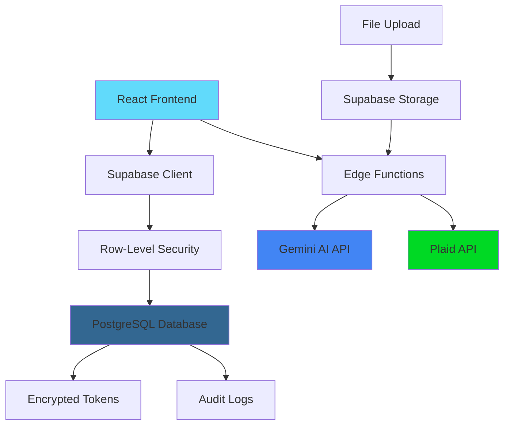

# FinanceManager-AI 🤖💰

> AI-powered personal finance management with intelligent insights and automated categorization

[]()
[](https://opensource.org/licenses/MIT)
[]()
[]()
[]()

## 🌟 Features

### 🤖 AI-Powered Financial Assistant
- **Conversational AI**: Chat with your personal finance assistant powered by Google Gemini
- **Document Analysis**: Upload and analyze PDFs, bank statements, and financial documents
- **Smart Insights**: Get personalized recommendations based on your spending patterns
- **Coach Mode**: Educational guidance with step-by-step financial coaching

### 💳 Comprehensive Financial Management
- **Bank Integration**: Secure Plaid integration for automatic transaction syncing
- **Transaction Categorization**: AI-powered automatic categorization with manual override
- **Bill Tracking**: Never miss a payment with intelligent bill reminders
- **Goal Setting**: Set and track financial goals with progress visualization
- **Budget Overview**: Real-time financial health snapshot

### 🔒 Security & Privacy
- **End-to-End Encryption**: Plaid tokens encrypted with AES-256
- **Row-Level Security**: Supabase RLS policies ensure data isolation
- **Audit Logging**: Comprehensive security event tracking
- **Rate Limiting**: Protection against abuse and unauthorized access

### 📱 Modern User Experience
- **Responsive Design**: Works perfectly on desktop, tablet, and mobile
- **Dark/Light Theme**: Automatic theme switching based on system preference
- **Real-time Updates**: Live data synchronization across all devices
- **Demo Mode**: Try the app with sample data and guided tour

## 🚀 Quick Start

### Prerequisites
- Node.js 18+ and npm
- Supabase account
- Google Gemini API key
- Plaid account (for bank integration)

### Installation

1. **Clone the repository**
   ```bash
   git clone https://github.com/yourusername/financemanager-ai.git
   cd financemanager-ai
   ```

2. **Install dependencies**
   ```bash
   npm install
   ```

3. **Set up environment variables**
   ```bash
   cp .env.example .env
   ```
   
   Configure your `.env` file:
   ```env
   VITE_SUPABASE_URL=your_supabase_url
   VITE_SUPABASE_ANON_KEY=your_supabase_anon_key
   ```

4. **Configure Supabase secrets** (for edge functions)
   - `GEMINI_API_KEY`: Your Google Gemini API key
   - `PLAID_CLIENT_ID`: Plaid client ID
   - `PLAID_SECRET`: Plaid secret key
   - `PLAID_ENCRYPTION_KEY`: 32-byte encryption key for token security

5. **Run the development server**
   ```bash
   npm run dev
   ```

6. **Try the demo**
   - Visit `http://localhost:3000`
   - Click "Try a 5-message demo" to explore with sample data

## 🏗️ Architecture



### Key Components

- **Frontend**: React 18 + TypeScript + Tailwind CSS
- **Backend**: Supabase (PostgreSQL + Edge Functions)
- **AI Integration**: Google Gemini 2.0 Flash for conversational AI
- **Bank Integration**: Plaid for secure transaction syncing
- **File Storage**: Supabase Storage with security policies
- **Authentication**: Supabase Auth with email/password

## 📊 Database Schema

### Core Tables
- `profiles` - User profiles and encrypted Plaid tokens
- `accounts` - Bank accounts and balances
- `transactions` - Financial transactions with AI categorization
- `goals` - Financial goals and progress tracking
- `bills` - Bill tracking and payment reminders
- `conversations` - AI chat history and context
- `user_memories` - Persistent AI context and preferences

### Security Features
- **RLS Policies**: Every table has row-level security
- **Encrypted Storage**: Sensitive data encrypted at rest
- **Audit Trails**: Comprehensive logging for security events
- **Rate Limiting**: Built-in protection against abuse

## 🔗 API Endpoints

### Edge Functions
- `POST /gemini-chat` - AI conversation interface
- `POST /plaid-link-exchange` - Exchange Plaid public token
- `POST /plaid-sync` - Sync transactions from Plaid
- `POST /send-budget-email` - Email budget reports
- `POST /send-budget-sms` - SMS notifications
- `GET /share-get-budget-by-token` - Shared budget access

### Key Features
- **CORS Enabled**: Proper cross-origin request handling
- **Authentication**: JWT verification for protected endpoints
- **Error Handling**: Comprehensive error responses
- **Logging**: Detailed request/response logging

## 🧪 Testing

```bash
# Run all tests
npm test

# Run tests in watch mode
npm run test:watch

# Run e2e tests
npm run test:e2e

# Generate coverage report
npm run test:coverage
```

### Test Coverage
- Unit tests for React components
- Integration tests for edge functions
- E2E tests for critical user flows
- Mock integrations for external APIs

## 🛡️ Security

### Data Protection
- **Encryption**: AES-256 for sensitive tokens
- **RLS**: Database-level access control
- **HTTPS**: All communications encrypted in transit
- **Input Validation**: Comprehensive sanitization

### Privacy
- **Data Minimization**: Only necessary data collected
- **User Control**: Users can delete their data
- **Transparency**: Clear privacy policy and data usage
- **Compliance**: GDPR considerations implemented

## 🤝 Contributing

We welcome contributions! Please see our [Contributing Guide](CONTRIBUTING.md) for details.

### Development Workflow
1. Fork the repository
2. Create a feature branch (`git checkout -b feature/amazing-feature`)
3. Commit your changes (`git commit -m 'Add amazing feature'`)
4. Push to the branch (`git push origin feature/amazing-feature`)
5. Open a Pull Request

### Code Standards
- TypeScript for type safety
- ESLint + Prettier for code formatting
- Conventional commits for version control
- Jest for testing with >80% coverage

## 📄 License

This project is licensed under the MIT License - see the [LICENSE](LICENSE) file for details.

## 🎯 Roadmap

- [ ] **v1.1**: Advanced AI features (streaming responses, multi-modal analysis)
- [ ] **v1.2**: Enhanced integrations (more banks, investment accounts)
- [ ] **v1.3**: Team features (shared budgets, family accounts)
- [ ] **v1.4**: Advanced analytics (spending predictions, savings optimization)
- [ ] **v1.5**: Mobile app (React Native)

## 🆘 Support

- 📚 [Documentation](https://docs.financemanager-ai.com)
- 💬 [Discord Community](https://discord.gg/financemanager-ai)
- 🐛 [Report Issues](https://github.com/yourusername/financemanager-ai/issues)
- 📧 [Email Support](mailto:support@financemanager-ai.com)

## ⭐ Acknowledgments

- [Supabase](https://supabase.com) for the amazing backend platform
- [Google Gemini](https://deepmind.google/technologies/gemini/) for AI capabilities
- [Plaid](https://plaid.com) for secure banking integration
- [Tailwind CSS](https://tailwindcss.com) for beautiful styling
- [React](https://reactjs.org) for the frontend framework

---

<div align="center">
  <strong>Made with ❤️ by the FinanceManager-AI team</strong>
  <br>
  <a href="https://financemanager-ai.com">Website</a> •
  <a href="https://twitter.com/financemanagerai">Twitter</a> •
  <a href="https://github.com/yourusername/financemanager-ai">GitHub</a>
</div>